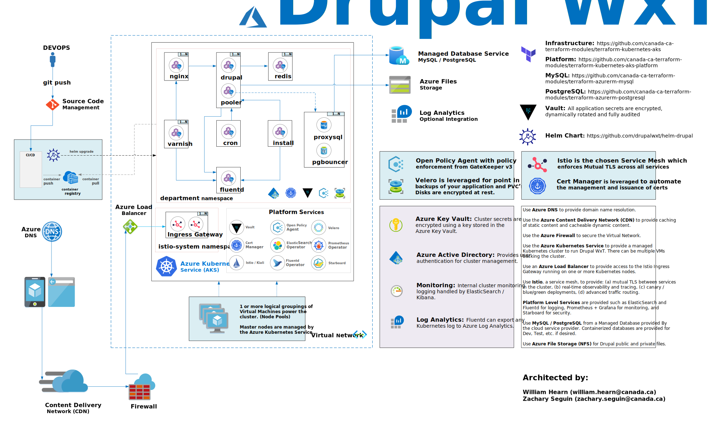

## Introduction

* **[Architectural Diagram][architectural-diagram]**
* **[Helm Chart for Drupal WxT][helm-drupal]**

This document represents a high-level technical overview of how the **[Helm Chart for Drupal WxT][helm-drupal]** was built and how we envision **[Drupal][drupal]** itself should be architected in the cloud to support any of the Government of Canada procured cloud service providers (`AWS`, `Azure`, and `GCP`). It should be noted that this Helm chart would also work in an on-premise environment with the appropriate Kubernetes infrastructure.

A key mandate when creating this architecture was to follow the Open Source Directive as given by the Treasury Board Secretariat (C.2.3.8) which states that you should try to use open standards and open source software first. Additionally, where possible all functionality should be exposed as restful services and leverage microservices via a containerized approach (C2.3.10).

We are leveraging a microservices design pattern utilizing immutable and scanned images through containerization running on Kubernetes with a platform that has been built and open sourced by Statistics Canada. While the platform will be discussed briefly to provide context the bulk of the document discusses how Drupal is installed and configured on top of it.

## Kubernetes

{}
The base of the platform - Kubernetes is the first graduate of the **[CNCF](https://www.cncf.io)** (Cloud Native Computing Foundation).
{}

**[Kubernetes][kubernetes]** orchestrates the computing, networking, and storage infrastructure on behalf of user workloads. It assigns workloads and resources to a series of nearly identically-configured virtual machines.

Kukbernetes supports workloads running anywhere, from IoT devices, to private cloud and all the way to public cloud. This is possible due to Kubernetes' pluggable architecture, which defines interfaces that are then implemented for the different environments. Kubernetes provides an Infrastructure as Code environment defined through declarative configuration. Because Kubernetes abstracts away the implementation of the computing environment, application dependencies such as storage, networking, etc., applications do not have to concern themselves with these differences.

Kubernetes is backed by a huge (10,000+) and vibrant growing community, consisting of end users, business, vendors and large cloud providers.

### Key Points

This architecture brings many benefits to the Government of Canada:

* Support for hybrid workloads (Linux and Windows), deployed using the same methodology
* Abstraction of underlying hardware ("cattle rather than pets") enabling an automated, highly-available and scaleable infrastructure for microservices
* Declarative configuration enabling Infrastructure as Code allowing for deployment automation, reproducibility and re-use
* Constructs to support advanced deployment patterns (blue/green, canary, etc.) enabling zero-downtime deployments
* Platform-level tooling for traffic handling (routing, error recovery, encyption, etc.), monitoring, observability and logging, and secrets management

Kubernetes is supported across all cloud service providers (fully managed and self managed), preventing vendor lock-in. Managed offerings are available from Google, IBM, Azure, Digital Ocean, Amazon, Oracle and more. The choice whether to roll your own, using a managed service (AKS, EKS, GKE) or a Platform as a Service (OpenShift, Pivotal) is up to the organization to decide based on their requirements and risks. Our preference is to stay as close as possible to the open source version of Kubernetes as well as tooling in order to remain compatible with the different Kubernetes offerings (raw, managed, platform, etc.).

## Government

Kubernetes is being actively investigated and/or used by many departments across the Government of Canada. Departments are starting to collaborate more and work together towards a common, well-vetted solution and this is why we have have Open Sourced our platform on the GC Accelerators hoping to foster this collaboration and form a community of practice.

Provided below is the Terraform (Infrastructure as Code) necessarily to install the Azure Kubernetes Service Infrastructure as well as configure with optional platform components (RBAC, Service Mesh, Policies, etc).

* **[Terraform for Kubernetes Infrastructure][aks]**
* **[Terraform for Kubernetes Platform][aks-platform]**

## Drupal WxT on Kubernetes

A managed Drupal Platform as a Service is a strong candidate to take advantage of what a Kubernetes platform offers. The design enables a quick onboarding of new workloads through the repeatable deployment methodology provided by Kubernetes.

### Kubernetes

**Recommendation:** **[Kubernetes][kubernetes]**

* **[Helm Chart for Drupal WxT][helm-drupal]**

Kubernetes is the basis of the Drupal platform and was further discussed above.

The whole Drupal application stack can be easily installed in a distributed fashion in minutes using our Helm chart, The chart facilitates a managed service workflow (rolling updates, cronjobs, health checks, auto-scaling, etc.) without user intervention.

### Ingress controller

**Recommendation:** **[Istio][istio]**

The ingress controller is responsible for accepting external HTTPS connections and routing them to backend applications based on configuration defined in Kubernetes Ingress objects. Routing can be done by domain and/or path.

### Varnish

**Recommendation:** **[Varnish][varnish]**

Varnish is a highly customizable reverse proxy cache. This will aid in supporting a large number of concurrent visitors as the final rendered pages can be served from cache. Varnish is only required on the public environment and is not used in the content staging environment.

Nginx can technically address some of the cache requirements needed, however the open source version does not support purging selective pages. We need to clear caches based on content being updated / saved which Varnish supports along with the Expire Drupal module quite readily

### Nginx

**Recommendation:** **[Nginx][nginx]**

Nginx is an open source web server that can also be used a reverse proxy, HTTP cache, and load balancer. Due to its root in performance optimization under scale, Nginx often outperforms similarly popular web servers and is built to offer low memory usage, and high concurrency.

### Web (PHP-FPM)

**Recommendation:** **[PHP-FPM][php-fpm]**

Drupal runs in the PHP runtime environment. PHP-FPM is the process manager organized as a master process managing pools of individual worker processes. Its architecture shares design similarities with event-driven web servers such as Nginx and allows for PHP scripts to use as much of the server&#39;s available resources as necessary without additional overhead that comes from running them inside of web server processes.

The PHP-FPM master process dynamically creates and terminates worker processes (within configurable limits) as traffic to PHP scripts increases and decreases. Processing scripts in this way allows for much higher processing performance, improved security, and better stability. The primary performance benefits from using PHP-FPM are more efficient PHP handling and ability to use opcode caching.

### Redis

**Recommendation:** **[Redis][redis]**

Redis is an advanced key-value cache and store.

It is often referred to as a data structure server since keys can contain strings, hashes, lists, sets, sorted sets, bitmaps, etc.

Redis is particularly useful when using cloud managed databases to limit the overall database load and to make performance more consistent.

### Database

**Recommendation:** **[MySQL][mysql]** or **[PostgreSQL][postgresql]**

* **[Terraform for MySQL Database][terraform-mysql]**
* **[Terraform for PostgreSQL Database][terraform-postgresql]**

Drupal maintains its state in a database and while supports several types only MySQL or PostgreSQL should be considered. Personally, we highly recommend PostgreSQL based on the experience we had building / launching quite a few Drupal sites in the cloud with it. However both run quite well with minimal operational concerns. Additionally the Helm Chart supports connection pooling using either **[ProxySQL][proxysql]** and / or **[PGBouncer][pgbouncer]** depending on the database used.

* **[ProxySQL][proxysql]**
* **[PGBouncer][pgbouncer]**

> **Note**: Our recommendation would be to use a managed database offering from the cloud providers for a production environment. Coupled with a managed file service, this removes all stateful components from the cluster enabling the best application experience possible.

### Stateful Assets

Drupal stores generated CSS/JS assets and uploaded content (images, videos, etc.) in a file storage. As the architecture is designed to be distributed, this present some design considerations for us.

#### Azure Files (CIFS / NFS)

Fully managed file shares in the cloud that are accessible via Server Message Block (SMB) or NFS protocol. Support is provided for dynamically creating and using a persistent volume with Azure Files in the Azure Kubernetes Service.

For more information on **[Azure Files](https://azure.microsoft.com/en-us/services/storage/files/#overview)**, please see **[Azure Files and AKS][azure-files].**

> **Note**: This is currently our recommended choice as it results in a simpler installation in Azure then relying on an S3 compatible object store discussed below. Similar storage solutions exist with the other cloud providers.

<!-- Links Referenced -->

[aks]:                     https://github.com/canada-ca-terraform-modules/terraform-kubernetes-aks
[aks-platform]:            https://github.com/canada-ca-terraform-modules/terraform-kubernetes-aks-platform
[architectural-diagram]:   https://github.com/drupalwxt/helm-drupal/blob/master/docs/diagram-drupal.pdf
[azure-files]:             https://docs.microsoft.com/en-us/azure/aks/azure-files-dynamic-pv
[cncf]:                    https://www.cncf.io
[devsecops]:               https://software.af.mil/dsop/documents/
[docker]:                  https://hub.docker.com/r/drupalwxt/site-wxt
[drupal]:                  https://github.com/drupalwxt/wxt
[iks]:                     https://github.com/canada-ca-terraform-modules/terraform-kubernetes-iks
[iks-platform]:            https://github.com/canada-ca-terraform-modules/terraform-kubernetes-iks-platform
[jfrog-artifactory]:       https://jfrog.com/artifactory
[jfrog-xray]:              https://jfrog.com/xray
[govcloud]:                https://govcloud.ca
[istio]:                   https://istio.io/docs/tasks/traffic-management/ingress/ingress-control
[github-wxt]:              https://github.com/drupalwxt/wxt/actions
[github-site-wxt]:         https://github.com/drupalwxt/site-wxt/actions
[helm-drupal]:             https://github.com/drupalwxt/helm-drupal
[kubernetes]:              https://kubernetes.io
[minio]:                   https://www.minio.io
[mysql]:                   https://www.mysql.com
[nginx]:                   https://www.nginx.com
[pgbouncer]:               https://www.pgbouncer.org
[php-fpm]:                 https://php-fpm.org
[postgresql]:              https://www.postgresql.org
[proxysql]:                https://proxysql.com
[redis]:                   https://redis.io
[site-wxt]:                https://github.com/drupalwxt/site-wxt
[solr-operator]:           https://github.com/apache/solr-operator
[terraform-mysql]:         https://github.com/canada-ca-terraform-modules/terraform-azurerm-mysql
[terraform-postgresql]:    https://github.com/canada-ca-terraform-modules/terraform-azurerm-postgresql
[varnish]:                 https://varnish-cache.org
[wxt]:                     https://github.com/drupalwxt/wxt
[youtube-digican]:         https://www.youtube.com/watch?v=QvMWls8OdmM
